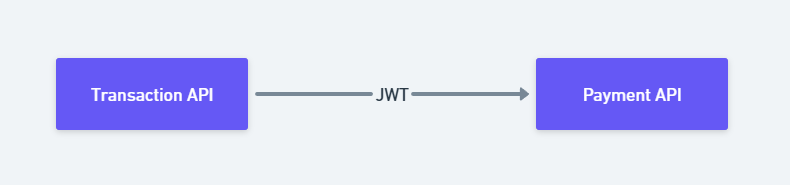
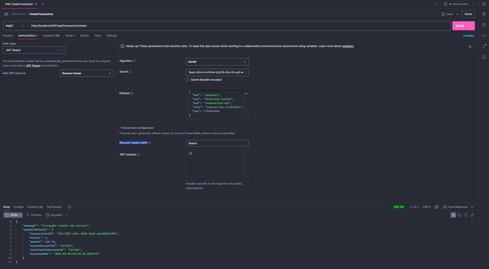

# Security JWT para APIs .NET 8

Este projeto ¨¦ uma prova de conceito (POC) que demonstra a implementa??o de JWT (JSON Web Tokens) em um sistema financeiro composto por duas APIs em .NET 8.

## Vis?o Geral do Projeto

O projeto consiste em duas APIs:

1. **TransactionAPI** - API respons¨¢vel por iniciar transa??es financeiras
2. **PaymentAPI** - API respons¨¢vel por processar pagamentos

A comunica??o entre as APIs ¨¦ protegida usando JWT, onde a TransactionAPI gera um token JWT para autenticar-se na PaymentAPI.

### Diagrama de Arquitetura

O diagrama abaixo ilustra o fluxo de autentica??o JWT entre as duas APIs:



## Tecnologias Utilizadas

- .NET 8
- ASP.NET Core Web API
- JWT (JSON Web Tokens)
- Autentica??o e Autoriza??o baseada em roles
- HttpClient para comunica??o entre APIs

## Estrutura do Projeto

- **TransactionAPI**
  - Endpoint para cria??o de transa??es
  - Gera??o de tokens JWT para acessar a PaymentAPI
  - Autoriza??o baseada em role "transaction_initiator"

- **PaymentAPI**
  - Endpoint para processamento de pagamentos
  - Valida??o de tokens JWT
  - Autoriza??o baseada em role "payment_processor"

## Pr¨¦-requisitos

- .NET 8 SDK
- Visual Studio 2022 ou VS Code
- Postman (para testes)

## Como Executar o Projeto

### Configurando o ambiente

1. Clone o reposit¨®rio:
   ```
   git clone https://github.com/seu-usuario/security-jwt-dotnet.git
   cd security-jwt-dotnet
   ```

2. Restaure as depend¨ºncias e compile as APIs:

   **Para a PaymentAPI:**
   ```
   cd PaymentAPI
   dotnet restore
   dotnet build
   ```

   **Para a TransactionAPI:**
   ```
   cd TransactionAPI
   dotnet restore
   dotnet build
   ```

### Executando as APIs

? importante executar ambas as APIs simultaneamente, pois a TransactionAPI depende da PaymentAPI.

**PaymentAPI** - Execute em um terminal:
```
cd PaymentAPI/PaymentAPI
dotnet run
```
A API estar¨¢ dispon¨ªvel em: http://localhost:5000

**TransactionAPI** - Execute em outro terminal:
```
cd TransactionAPI/TransactionAPI
dotnet run
```
A API estar¨¢ dispon¨ªvel em: http://localhost:5001

## Testando com Postman

### 1. Configurando o Postman

1. Abra o Postman e crie uma nova cole??o chamada "JWT Financial System"
2. Adicione uma nova requisi??o POST para criar uma transa??o conforme instru??es abaixo

### 2. Testando a API de Transa??es

Para testar o fluxo completo, voc¨º precisa criar uma transa??o na TransactionAPI atraves de uma requisi??o tambem autenticada com JWT, que por sua vez ir¨¢ se comunicar com a PaymentAPI:

**Requisi??o POST para criar uma transa??o:**
- M¨¦todo: `POST`
- URL: `http://localhost:5001/api/transaction/create`
- Headers:
  - Content-Type: `application/json`
- Body (raw JSON):
  ```json
  {
    "amount": 100.50,
    "sourceAccountId": "ACC123456",
    "destinationAccountId": "ACC789012"
  }
  ```
- Authorization:
    - Auth Type: JWT Bearer
    - Algorithm: HS256
    - Secret: 3ss4-s3r4-4-m1nh4-s3cr3t-k3y-t0-us3-w1th-th1s-4pp
    - Payload (JSON):
        ```
        {
            "sub": "usertest",
            "iss": "financial-system",
            "aud": "transaction-api",
            "role": "transaction_initiator",
            "exp": 1744060800 
        }
        ```
    - Request header prefix: Bearer

- 


A TransactionAPI gerar¨¢ automaticamente um token JWT para autenticar-se na PaymentAPI.

### 3. Exemplos de Resposta

Se tudo ocorrer deve ser gerada uma saida similar:

```json
{
  "message": "Transa??o criada com sucesso",
  "paymentDetails": {
    "transactionId": "3fa85f64-5717-4562-b3fc-2c963f66afa6",
    "status": "Processed",
    "amount": 100.50,
    "sourceAccountId": "ACC123456",
    "destinationAccountId": "ACC789012",
    "processedAt": "2023-09-20T15:32:05.123Z"
  }
}
```

## Fluxo de Autentica??o JWT

1. O Postman gera uma token para se autenticar com a TransactionAPI 
2. A TransactionAPI valida a token e request enviada pelo Postman para prosseguir
3. A TransactionAPI gera um token JWT com claims espec¨ªficas
4. O token JWT ¨¦ enviado no cabe?alho de autoriza??o para a PaymentAPI
5. A PaymentAPI valida o token JWT e verifica as claims
6. Se v¨¢lido, a PaymentAPI processa a requisi??o e retorna o resultado

## Seguran?a e Boas Pr¨¢ticas

- A chave de assinatura do JWT est¨¢ codificada diretamente apenas para fins de demonstra??o
- Em ambiente de produ??o seria ideal avaliar:
  - AWS Secrets Manager ou similar para armazenar chaves
  - Per¨ªodos de expira??o mais curtos para os tokens
  - HTTPS para todas as comunica??es